# Mermaid 真实文章示例汇总

本文集中展示从 `MyBlog-Content/posts` 中提取的 45 个真实 Mermaid 图表。图表源码保持不变，并按原文章分组，便于集中检查静态 SVG 的布局、字体、标签和主题效果。

## 博客国内外双节点部署与全链路架构解耦

来源：`blog-dual-region/index.md`

### 图 1

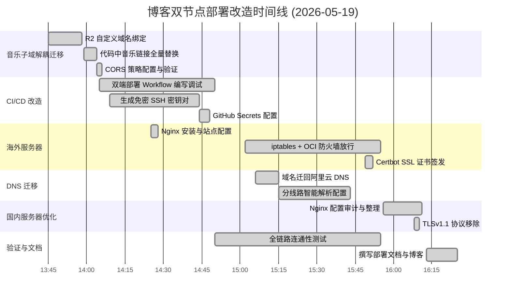

### 图 2

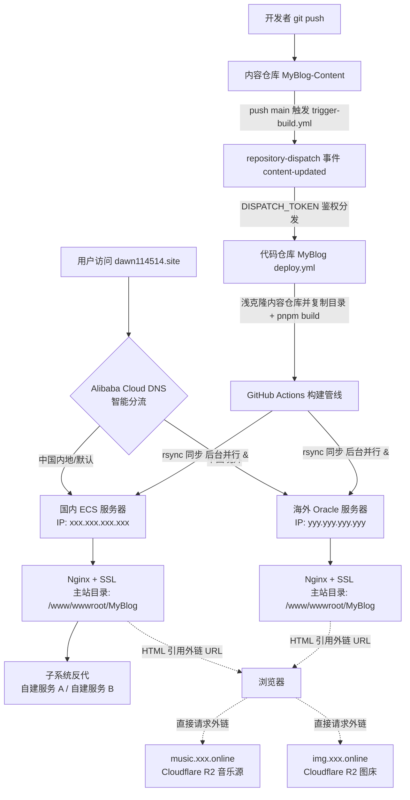

### 图 3

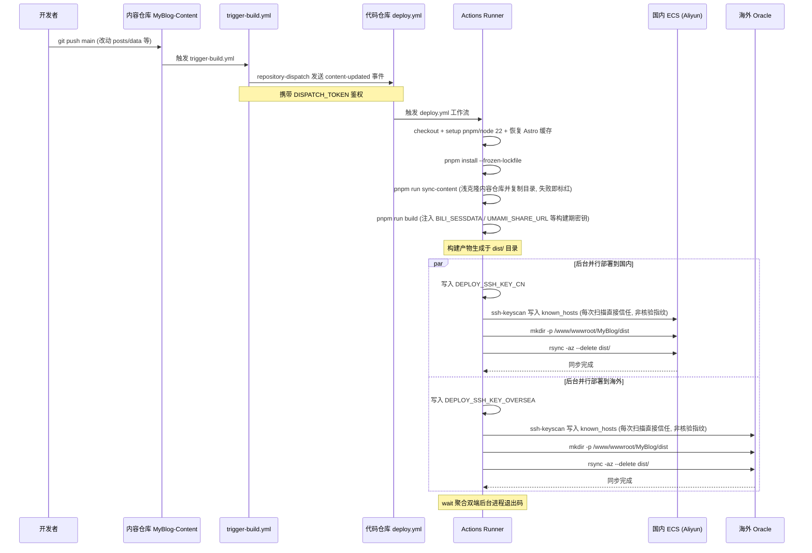

## 搭建“黎明の鸡窝”

来源：`komari-monitor/index.md`

### 图 1

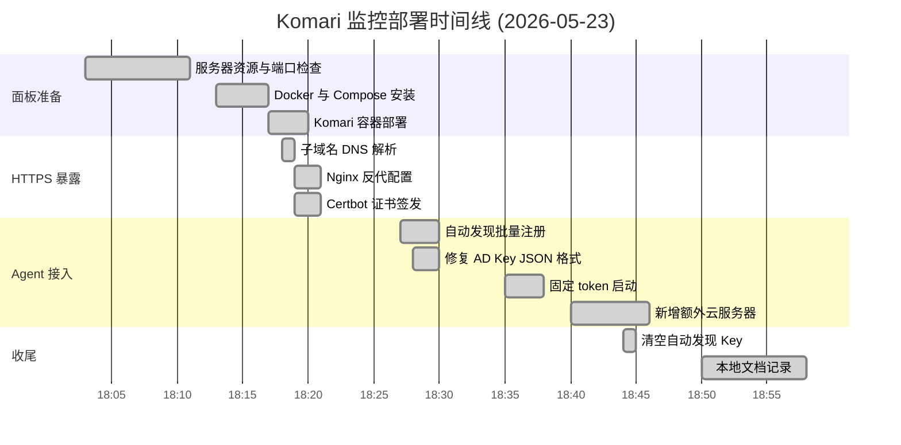

### 图 2

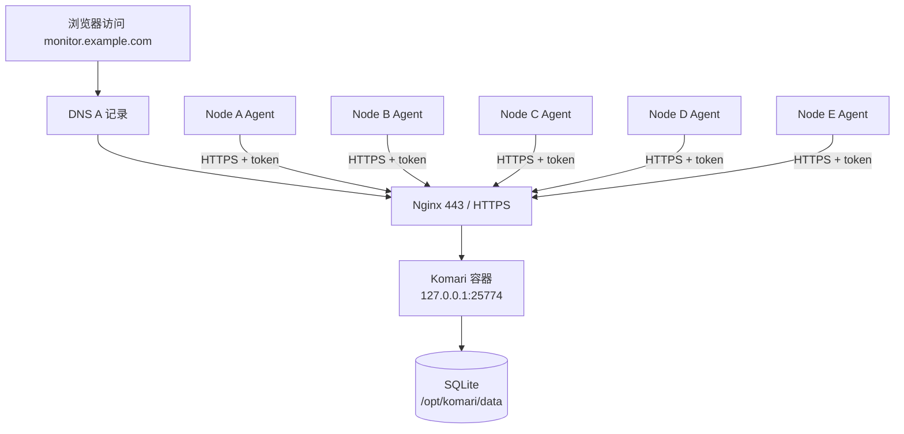

## 用 Restic 备份本地却在疯狂吃磁盘？

来源：`restic-disk-cleanup/index.md`

### 图 1

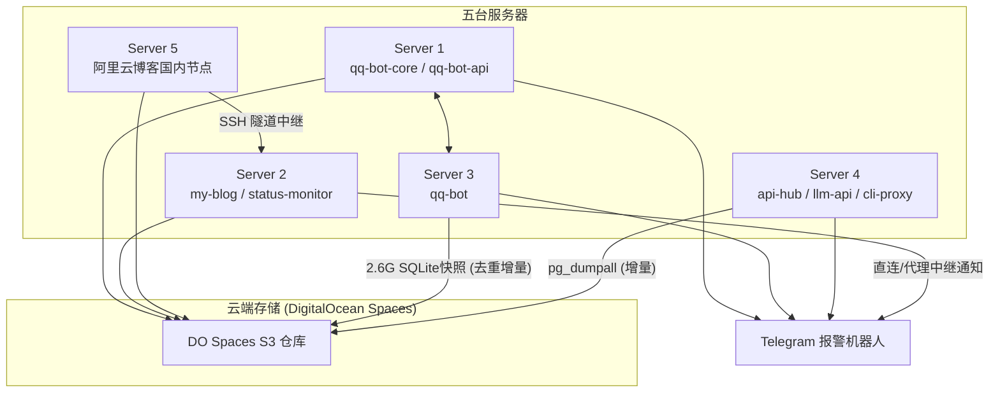

## “如果今天服务器炸了怎么办？”

来源：`restic-spaces-backup/index.md`

### 图 1

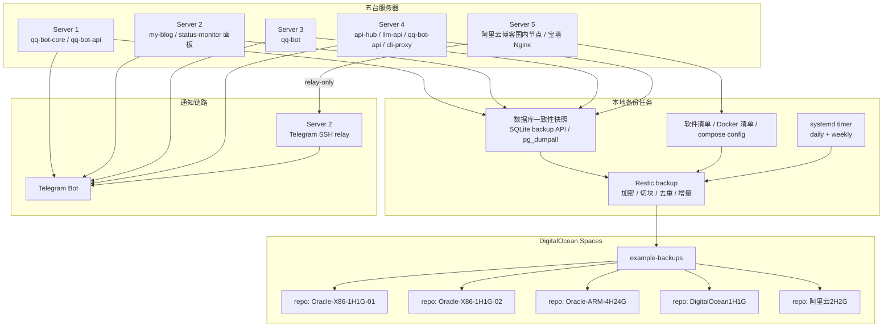

### 图 2

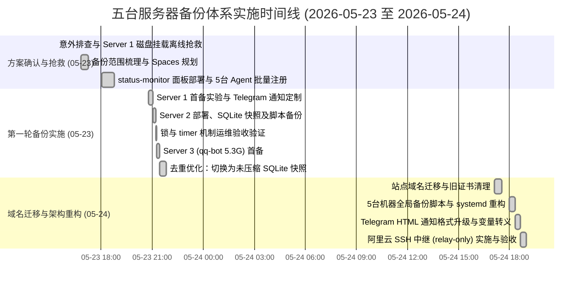

### 图 3

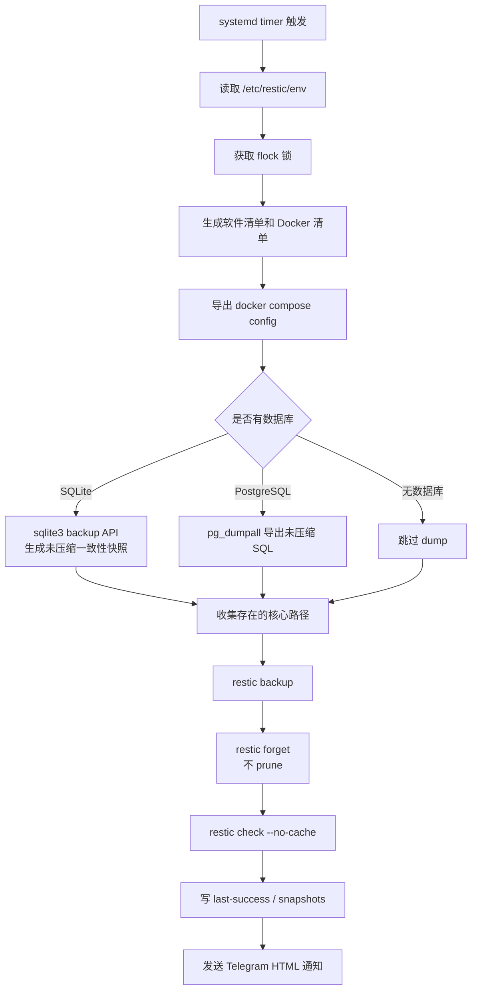

### 图 4

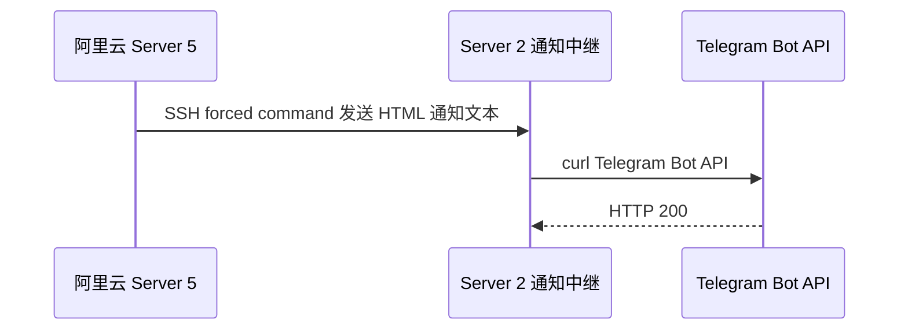

## Restic 仓库迁移记

来源：`restic-spaces-to-r2/index.md`

### 图 1

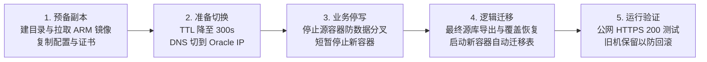

### 图 2

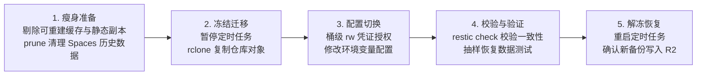

### 图 3

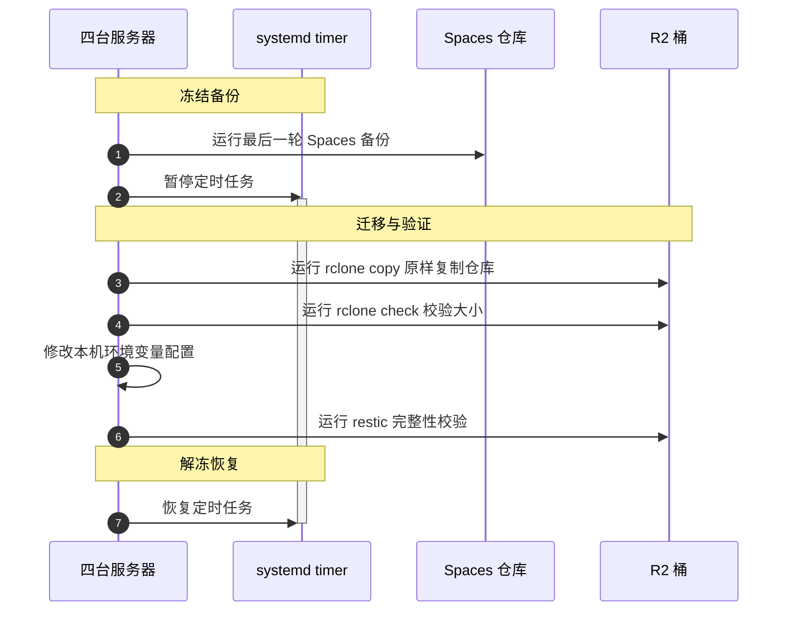

### 图 4

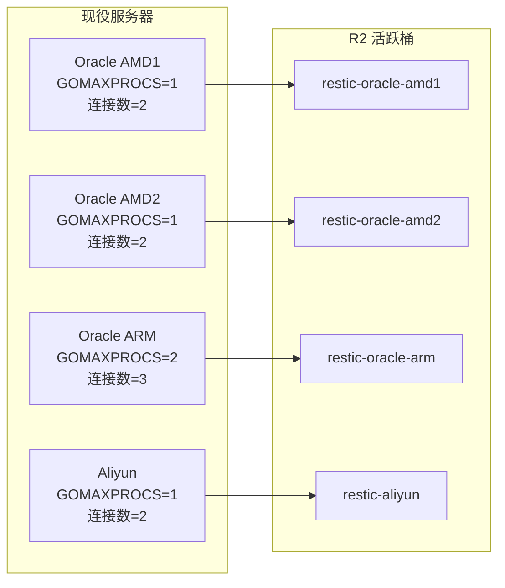

### 图 5


## 0-1 背包问题（动态规划、回溯法、分支限界法）

来源：`algorithm/01Knapsack/index.md`

### 图 1

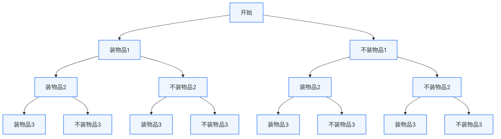

### 图 2

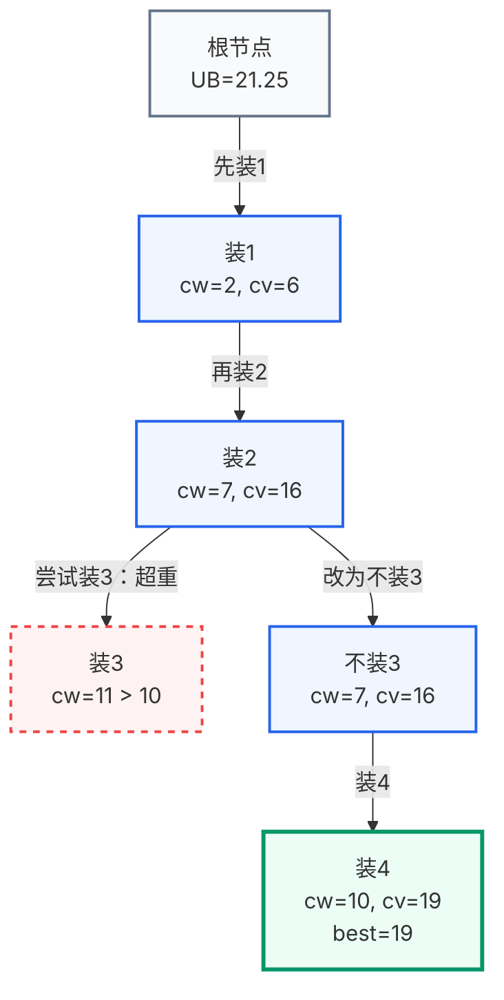

### 图 3

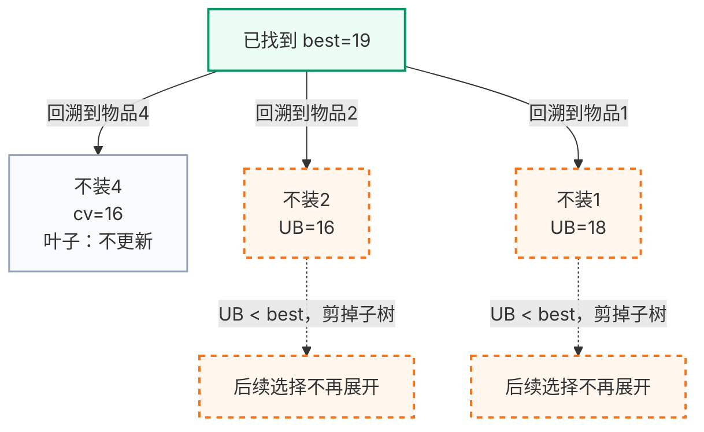

### 图 4

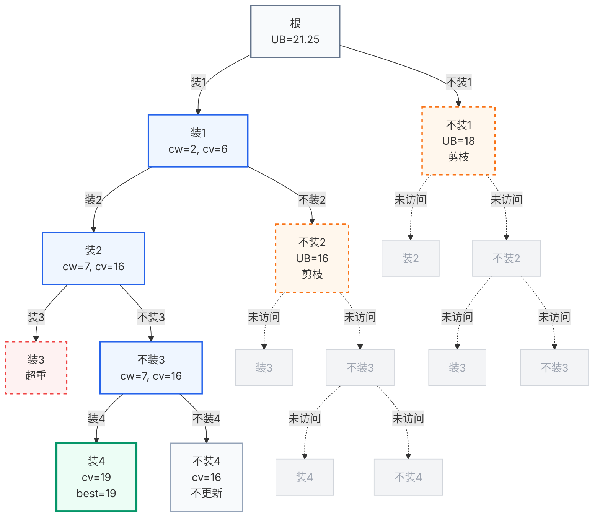

### 图 5

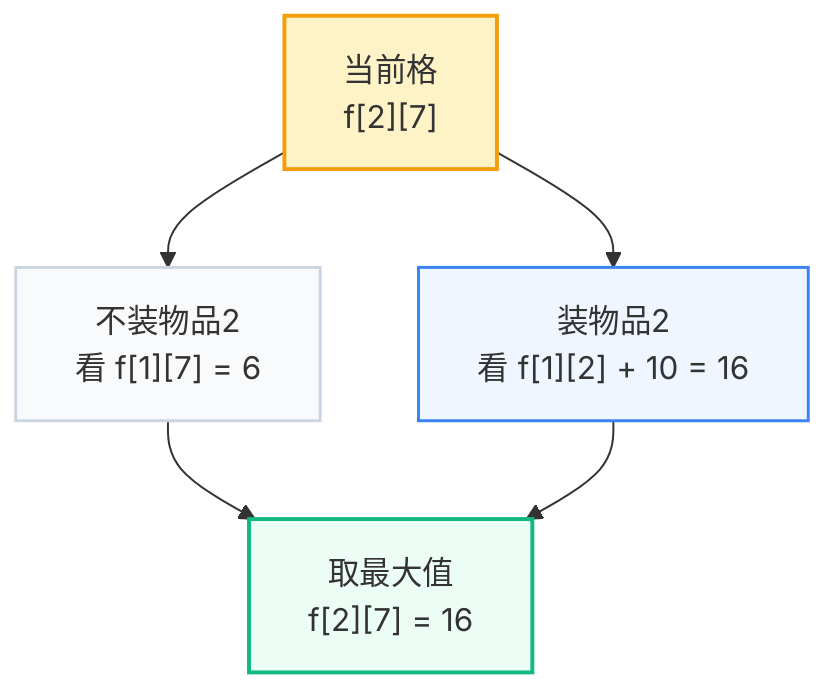

### 图 6

```mermaid
flowchart RL
    classDef cell fill:#eff6ff,stroke:#3b82f6,stroke-width:1.5px,font-family:Inter;
    classDef warn fill:#fef3c7,stroke:#f59e0b,stroke-width:2px,font-family:Inter;

    J10["dp[10]"]:::cell --> J9["dp[9]"]:::cell --> J8["dp[8]"]:::cell --> J7["..."]:::cell --> JW["dp[w]"]:::cell
    N["容量从大到小更新<br>保证 dp[j-w] 仍来自上一轮"]:::warn
    J10 -.-> N
```

### 图 7

```mermaid
graph TD
    classDef root fill:#f8fafc,stroke:#64748b,stroke-width:2px,font-family:Inter;
    classDef active fill:#fef3c7,stroke:#f59e0b,stroke-width:2px,font-family:Inter;
    classDef wait fill:#eff6ff,stroke:#3b82f6,stroke-width:1.5px,font-family:Inter;

    R["根节点<br>UB=21.25"]:::root
    A["装1<br>UB=21.25<br>下一步扩展"]:::active
    B["不装1<br>UB=18.00<br>暂存队列"]:::wait

    R -->|装1| A
    R -->|不装1| B
```

### 图 8

```mermaid
graph TD
    classDef active fill:#fef3c7,stroke:#f59e0b,stroke-width:2px,font-family:Inter;
    classDef queue fill:#eff6ff,stroke:#3b82f6,stroke-width:1.5px,font-family:Inter;
    classDef root fill:#f8fafc,stroke:#64748b,stroke-width:2px,font-family:Inter;

    R["root<br>UB=21.25<br>出队扩展"]:::active
    A["装1<br>UB=21.25<br>队首"]:::queue
    B["不装1<br>UB=18.00<br>等待"]:::queue

    R -->|装1| A
    R -->|不装1| B
```

### 图 9

```mermaid
graph TD
    classDef active fill:#fef3c7,stroke:#f59e0b,stroke-width:2px,font-family:Inter;
    classDef queue fill:#eff6ff,stroke:#3b82f6,stroke-width:1.5px,font-family:Inter;
    classDef bound fill:#fff7ed,stroke:#f97316,stroke-width:2px,stroke-dasharray:5 5,font-family:Inter;
    classDef wait fill:#f8fafc,stroke:#94a3b8,stroke-width:1.5px,font-family:Inter;

    A["装1<br>UB=21.25<br>出队扩展"]:::active
    B["装2<br>UB=21.25<br>队首"]:::queue
    C["不装2<br>UB=16.00<br>不入队"]:::bound
    D["不装1<br>UB=18.00<br>等待"]:::wait

    A -->|装2| B
    A -->|不装2| C
    D -.->|仍在队列| B
```

### 图 10

```mermaid
graph TD
    classDef active fill:#fef3c7,stroke:#f59e0b,stroke-width:2px,font-family:Inter;
    classDef queue fill:#eff6ff,stroke:#3b82f6,stroke-width:1.5px,font-family:Inter;
    classDef overweight fill:#fef2f2,stroke:#ef4444,stroke-width:2px,stroke-dasharray:5 5,font-family:Inter;
    classDef wait fill:#f8fafc,stroke:#94a3b8,stroke-width:1.5px,font-family:Inter;

    A["装1,2<br>UB=21.25<br>出队扩展"]:::active
    B["装3<br>cw=11>10<br>超重"]:::overweight
    C["不装3<br>UB=19.00<br>队首"]:::queue
    D["不装1<br>UB=18.00<br>等待"]:::wait

    A -->|装3| B
    A -->|不装3| C
    D -.->|仍在队列| C
```

### 图 11

```mermaid
graph TD
    classDef active fill:#fef3c7,stroke:#f59e0b,stroke-width:2px,font-family:Inter;
    classDef best fill:#ecfdf5,stroke:#10b981,stroke-width:3px,font-family:Inter;
    classDef bound fill:#fff7ed,stroke:#f97316,stroke-width:2px,stroke-dasharray:5 5,font-family:Inter;
    classDef wait fill:#f8fafc,stroke:#94a3b8,stroke-width:1.5px,font-family:Inter;

    A["装1,2,不装3<br>UB=19.00<br>出队扩展"]:::active
    B["装4<br>cv=19<br>best=19"]:::best
    C["不装4<br>UB=16.00<br>不入队"]:::bound
    D["不装1<br>UB=18.00<br>等待"]:::wait

    A -->|装4| B
    A -->|不装4| C
    D -.->|仍在队列| B
```

### 图 12

```mermaid
graph TD
    classDef best fill:#ecfdf5,stroke:#10b981,stroke-width:3px,font-family:Inter;
    classDef bound fill:#fff7ed,stroke:#f97316,stroke-width:2px,stroke-dasharray:5 5,font-family:Inter;

    A["当前 best=19"]:::best
    B["不装1<br>UB=18.00<br>剪枝"]:::bound

    A -->|UB <= best| B
```

### 图 13

```mermaid
graph TD
    classDef root fill:#f8fafc,stroke:#64748b,stroke-width:2px,font-family:Inter;
    classDef active fill:#fef3c7,stroke:#f59e0b,stroke-width:2px,font-family:Inter;
    classDef queue fill:#eff6ff,stroke:#3b82f6,stroke-width:1.5px,font-family:Inter;
    classDef best fill:#ecfdf5,stroke:#10b981,stroke-width:3px,font-family:Inter;
    classDef bound fill:#fff7ed,stroke:#f97316,stroke-width:2px,stroke-dasharray:5 5,font-family:Inter;
    classDef overweight fill:#fef2f2,stroke:#ef4444,stroke-width:2px,stroke-dasharray:5 5,font-family:Inter;

    R["根<br>UB=21.25"]:::root

    A["装1<br>UB=21.25<br>第1个扩展"]:::active
    H["不装1<br>UB=18.00<br>先等待，后剪枝"]:::queue

    B["装2<br>UB=21.25<br>第2个扩展"]:::active
    G["不装2<br>UB=16.00<br>不入队"]:::bound

    C["装3<br>cw=11>10<br>超重"]:::overweight
    D["不装3<br>UB=19.00<br>第3个扩展"]:::active

    E["装4<br>cv=19<br>best=19"]:::best
    F["不装4<br>UB=16.00<br>不入队"]:::bound

    R -->|装1| A
    R -->|不装1| H

    A -->|装2| B
    A -->|不装2| G

    B -->|装3| C
    B -->|不装3| D

    D -->|装4| E
    D -->|不装4| F

    H -.->|最后出队<br>UB < best| Hx["剪枝"]:::bound
```

## 贪心算法：哈夫曼编码

来源：`algorithm/HuffmanCoding/index.md`

### 图 1

```mermaid
graph TD
    Root(( )) -->|0| A([A])
    Root(( )) -->|1| N1(( ))
    N1 -->|0| B([B])
    N1 -->|1| N2(( ))
    N2 -->|0| C([C])
    N2 -->|1| D([D])
```

### 图 2

```mermaid
graph TD
    Root((27)) -->|0| BCD((11))
    Root((27)) -->|1| AE((16))
    BCD -->|0| B([B:5])
    BCD -->|1| CD((6))
    CD -->|0| C([C:2])
    CD -->|1| D([D:4])
    AE -->|0| A([A:7])
    AE -->|1| E([E:9])
```

## 计算机系统概述

来源：`计组/计算机系统概述/index.md`

### 图 1

```mermaid
flowchart BT
    L1[第1层: 逻辑门层] --> L2[第2层: 微代码层]
    L2 --> L3[第3层: 指令集架构层]
    L3 --> L4[第4层: 操作系统层]
    L4 --> L5[第5层: 汇编语言层]
    L5 --> L6[第6层: 高级语言层]
```

## 数据信息的表示

来源：`计组/数据信息的表示/index.md`

### 图 1

```mermaid
flowchart TD
    Data[数据信息] --> Numeric[数值数据: 带有确定数值意义的数]
    Data --> NonNumeric[非数值数据: 文字、字符与多媒体]
    Numeric --> Unsigned[无符号数]
    Numeric --> Signed[有符号数]
    Signed --> Fixed[定点数]
    Signed --> Float[浮点数]
    NonNumeric --> Char[字符与文字]
    NonNumeric --> Media[多媒体数据: 图像、声音、视频]
```

### 图 2

```mermaid
gantt
    title IEEE 754 单精度浮点数 32 位布局
    dateFormat X
    axisFormat %s
    section 字段
    符号位 S (1位) : 0, 1
    阶码 E (8位)  : 1, 9
    尾数 M (23位) : 9, 32
```

## 运算方法与运算器

来源：`计组/运算方法与运算器/index.md`

### 图 1

```mermaid
flowchart BT
    subgraph 寄存器组
        R[通用寄存器]
        ACC[累加寄存器]
    end
    subgraph 数据输入
        MUX[多路选择器]
        TEMP[暂存器]
    end
    subgraph 核心算术逻辑
        ALU[算术逻辑单元]
    end
    subgraph 状态监测
        PSW[状态字寄存器]
    end

    R --> MUX
    ACC --> MUX
    MUX --> TEMP
    TEMP --> ALU
    ALU --> ACC
    ALU --> PSW
```

## 存储系统

来源：`计组/存储系统/index.md`

### 图 1

```mermaid
flowchart BT
    L4[外存: 磁盘、SSD、Flash] --> L3[主存: DRAM]
    L3 --> L2[高速缓存: SRAM]
    L2 --> L1[寄存器: CPU内部]
```

## 指令系统

来源：`计组/指令系统/index.md`

### 图 1

```mermaid
flowchart BT
    Hardware[底层硬件: 译码电路、数据通路、执行控制] --> ISA[接口层: 指令系统]
```

## 中央处理器

来源：`计组/中央处理器/index.md`

### 图 1

```mermaid
flowchart BT
    DataPath[数据通路: 寄存器组、ALU、移位器] --> Ctrl[操作控制信号驱动]
    CtrlGen[控制器: 译码电路、时序逻辑] --> Ctrl
    PSW[状态标志反馈] --> CtrlGen
```

### 图 2

```mermaid
flowchart BT
    CM[控制存储器 CM] --> uIR[微指令寄存器 uIR]
    uIR -->|顺序控制字段| uMAR[微地址寄存器 uMAR]
    IR[指令寄存器操作码] -->|微地址形成部件| uMAR
    uMAR --> CM
    uIR -->|操作控制字段| Ctrl[控制信号输出]
```

## 指令流水线

来源：`计组/指令流水线/index.md`

### 图 1

```mermaid
gantt
    title 4段流水线时空图 (6条指令)
    dateFormat X
    axisFormat %s

    section 取指(IF)
    I1 :0, 1
    I2 :1, 2
    I3 :2, 3
    I4 :3, 4
    I5 :4, 5
    I6 :5, 6

    section 译码(ID)
    I1 :1, 2
    I2 :2, 3
    I3 :3, 4
    I4 :4, 5
    I5 :5, 6
    I6 :6, 7

    section 执行(EX)
    I1 :2, 3
    I2 :3, 4
    I3 :4, 5
    I4 :5, 6
    I5 :6, 7
    I6 :7, 8

    section 写回(WB)
    I1 :3, 4
    I2 :4, 5
    I3 :5, 6
    I4 :6, 7
    I5 :7, 8
    I6 :8, 9
```

### 图 2

```mermaid
gantt
    title 5段流水线执行4条指令时空图
    dateFormat X
    axisFormat %s

    section IF
    I1 :0, 1
    I2 :1, 2
    I3 :2, 3
    I4 :3, 4

    section ID
    I1 :1, 2
    I2 :2, 3
    I3 :3, 4
    I4 :4, 5

    section EX
    I1 :2, 3
    I2 :3, 4
    I3 :4, 5
    I4 :5, 6

    section MEM
    I1 :3, 4
    I2 :4, 5
    I3 :5, 6
    I4 :6, 7

    section WB
    I1 :4, 5
    I2 :5, 6
    I3 :6, 7
    I4 :7, 8
```

## 总线系统

来源：`计组/总线系统/index.md`

### 图 1

```mermaid
graph LR
    A[申请与仲裁] --> B[寻址阶段]
    B --> C[传输阶段]
    C --> D[结束阶段]

    style A fill:#e1f5fe,stroke:#0288d1,stroke-width:2px
    style B fill:#fff3e0,stroke:#f57c00,stroke-width:2px
    style C fill:#e8f5e9,stroke:#388e3c,stroke-width:2px
    style D fill:#fce4ec,stroke:#c2185b,stroke-width:2px
```

### 图 2

```mermaid
graph TD
    subgraph 链式查询
        A1[仲裁器] -->|BG 串行| B1[设备0]
        B1 -->|BG 串行| C1[设备1]
        C1 -->|BG 串行| D1[设备n]
        B1 -.BR 汇线.- A1
        C1 -.BR 汇线.- A1
        D1 -.BR 汇线.- A1
    end
    subgraph 独立请求
        A2[仲裁器] <-->|BG0 / BR0| B2[设备0]
        A2 <-->|BG1 / BR1| C2[设备1]
        A2 <-->|BGn / BRn| D2[设备n]
    end
```

## 输入输出系统

来源：`计组/输入输出系统/index.md`

### 图 1

```mermaid
graph TD
    A[CPU 启动 I/O 设备] --> B{读取状态寄存器<br>设备已就绪?}
    B -- 否 --> B
    B -- 是 --> C[进行数据传输]
    C --> D[传输完毕, 继续执行后续程序]

    style B fill:#ffe0b2,stroke:#f57c00
```

### 图 2

```mermaid
graph TD
    A[原程序执行] --> B[当前指令结束]
    B --> C{有未屏蔽的中断请求?}
    C -- 否 --> A
    C -- 是 --> D(中断隐指令: 硬件自动完成)

    subgraph 中断隐指令
    D --> D1[1. 关中断]
    D1 --> D2[2. 保存断点 PC]
    D2 --> D3[3. 获中断服务程序入口]
    end

    D3 --> E(中断服务程序: 软件执行)

    subgraph 中断服务程序
    E --> E1[4. 保护现场]
    E1 --> E2[5. 可选: 开中断允许嵌套]
    E2 --> E3[6. 执行实际 I/O 传输]
    E3 --> E4[7. 可选: 关中断]
    E4 --> E5[8. 恢复现场]
    E5 --> E6[9. 开中断]
    E6 --> E7[10. 中断返回 IRET]
    end

    E7 --> A
```

## 常见概率分布

来源：`概率论/常见分布/index.md`

### 图 1

```mermaid
graph TD
    Bernoulli["两点分布"] -->|n次独立试验| Binomial["二项分布"]
    Binomial -->|n很大且p极小| Poisson["泊松分布"]
    Binomial -->|n很大且期望较大| Normal["正态分布"]
    Poisson -->|均值较大时| Normal
    Normal -->|标准化变换| StdNormal["标准正态分布"]
    StdNormal -->|独立变量平方和| ChiSquare["卡方分布"]
    StdNormal & ChiSquare -->|比值构成统计量| TDist["t 分布"]
    ChiSquare & ChiSquare -->|比值构成统计量| FDist["F 分布"]
    TDist -->|自由度趋于无穷| StdNormal
```
